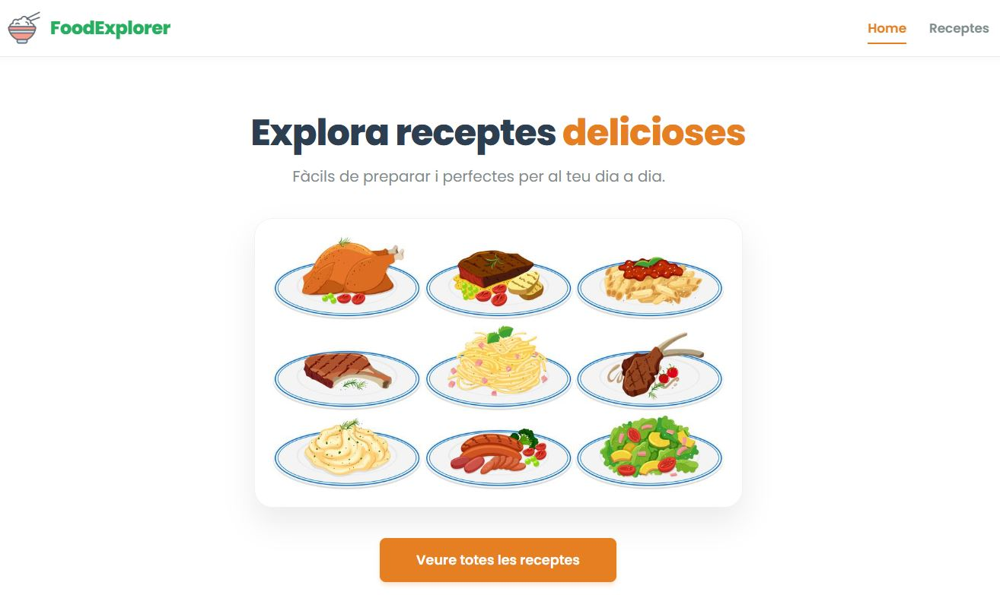
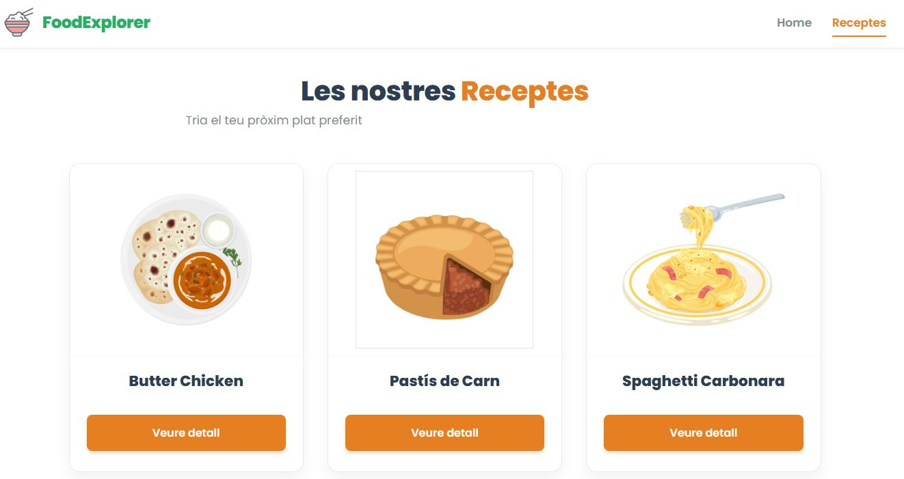
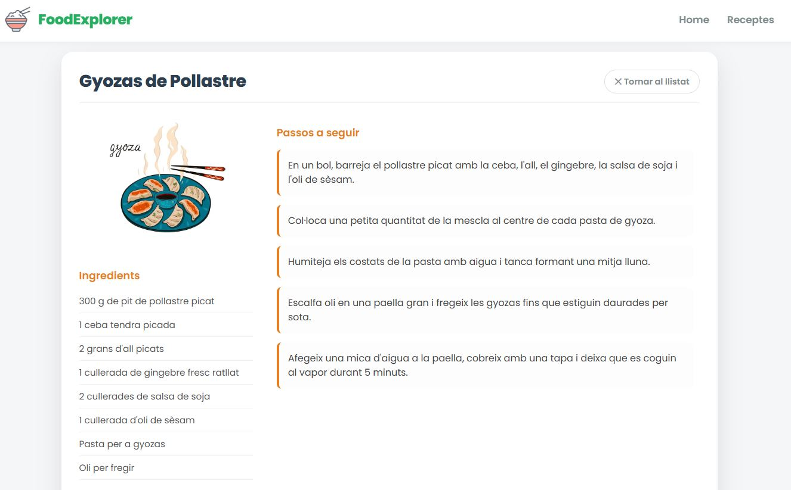

# 🥗 FoodExplorer

**FoodExplorer** és una aplicació web moderna i intuïtiva dissenyada per als amants de la cuina. Permet als usuaris explorar un llistat de receptes delicioses, veure'n els detalls, ingredients i passos de preparació en una interfície neta i professional.

Aquest projecte ha estat desenvolupat utilitzant l'ecosistema de **Vue 3**.

---

## 📸 Captures de Pantalla

### Pàgina d'Inici (Home)
Una benvinguda visual amb una crida a l'acció clara.

______________________________________________________

### Llistat de Receptes
Visualització en graella (Grid) responsiva amb targetes elegants.

_________________________________________________________________

### Detall de la Recepta
Vista completa sense scroll excessiu, amb ingredients i passos ben organitzats.

_______________________________________________________________________________

---

## ✨ Funcionalitats Principals

- **Navegació SPA (Single Page Application):** Navegació fluida entre pàgines sense recàrregues gràcies a Vue Router.
- **Disseny Responsiu:** Adaptat a mòbils, tauletes i escriptori.
- **Interfície Moderna:** Ús d'una paleta de colors professional (Blanc, Gris Fosc, Verd Esmeralda i Taronja) i tipografies netes (*Inter*).
- **Gestió d'Estat:** Ús de `provide` i `inject` per compartir les dades de les receptes entre components de manera eficient.
- **Visualització d'Imatges:** Imatges optimitzades amb ajust `object-fit: contain` per mostrar els plats complets sense talls.

---

## 📂 Estructura del Projecte
Breu descripció dels fitxers clau:
App.vue: Component arrel. Defineix la Navbar, conté les dades de les receptes i fa el provide global.
- router/index.js: Configuració de les rutes (/, /receptes, /recepta/:id).
- views/HomeView.vue: Pàgina de benvinguda.
- views/ReceptesView.vue: Llistat amb graella de targetes.
- views/ReceptaDetall.vue: Vista de detall amb disseny a dues columnes.

## 🛠️ Tecnologies Utilitzades

- **Vue.js 3:** Framework principal (utilitzant `<script setup>` i Composition API).
- **Vue Router:** Per a la gestió de rutes i navegació.
- **HTML5 i CSS3:** Estils personalitzats (scoped CSS) amb Flexbox i CSS Grid.
- **Vite:** Eina d'entorn de desenvolupament ràpid.

---

## 🚀 Instal·lació i Execució

Segueix aquests passos per executar el projecte al teu ordinador local:

1. **Clonar el repositori** :
  - git clone https://github.com/SerraSilvia/FoodExplorer.git
  - cd FoodExplorer
  * Instal·lar dependències:
   - npm install
  * Executar el servidor de desenvolupament:
   - npm run dev
   * Obrir al navegador:
   * Ves a l'adreça que apareix a la terminal (http://localhost:5173).

## ✒️ Autora
Creat per [SerraSilvia] com a projecte d'aprenentatge de Vue.js.
